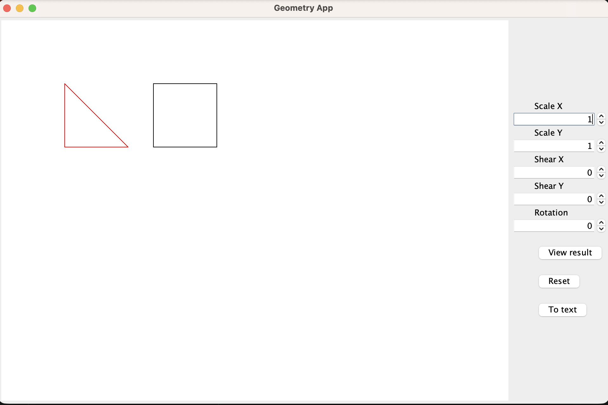

# Geometry

<div align="center">
  
</div>

A Java Swing desktop application for interactive 2D geometry transformation. It build shapes, apply affine transforms (scale, shear, rotation), and export the results.

Draw simple shapes (rectangles, triangles) and transform them visually using a 2×2 transformation matrix. Each shape is defined by connected line segments, and all transformations are computed from scratch.

## What's Interesting

- Three pluggable export formats (TOML, HTML, SVG) selected at runtime via `DrawingExportStrategyFactory`
- Test coverage using JUnit 4 for matrix operations and export formatting

## Quick Start

```bash
# Compile
javac -cp junit-platform-console-standalone-1.9.3.jar *.java -d target

# Run the app
java -cp target GeometryApp

# Run tests
java -jar junit-platform-console-standalone-1.9.3.jar -cp target --select-class GeometryTests
java -jar junit-platform-console-standalone-1.9.3.jar -cp target --select-class DrawingTests
```

> Note: Download `junit-platform-console-standalone-1.9.3.jar` from [JUnit's repository](https://repo1.maven.org/maven2/org/junit/platform/junit-platform-console-standalone/) if needed.

## How to Use

1. Launch the app -> a window appears with a drawing area and control panel
2. Adjust Scale X/Y, Shear X/Y, and Rotation spinners
3. Click View result to apply the transformation
4. Click Reset to return to the identity transform
5. Click To text to export the current drawing (defaults to TOML format)

## Export Formats

| Format | Description |
|---|---|
| TOML | Structured text with transform matrix and per-shape lines + color |
| HTML | Simple HTML page listing the transform and shapes |
| SVG | Scalable vector graphic with `<line>` elements |

## Project Structure

| File | Role |
|---|---|
| `GeometryApp.java` | Main Swing application with GUI controls |
| `GeometryView.java` | Drawing panel that renders transformed shapes |
| `Drawing.java` | Holds shapes and current transform matrix |
| `Shape.java` | A 2D polygon defined by connected lines |
| `Line.java` | A line segment between two points |
| `Point.java` | A 2D coordinate |
| `TransformMatrix.java` | 2×2 matrix operations (multiply, apply, update) |
| `DrawingExportStrategy.java` | Interface for export formats |
| `DrawingExportStrategyFactory.java` | Factory that selects the export strategy |
| `*ExportStrategy.java` | TOML, HTML, and SVG export implementations |
| `GeometryTests.java` | Tests for TransformMatrix operations |
| `DrawingTests.java` | Tests for Drawing and export strategies |

## License

MIT — see [LICENSE](LICENSE).
